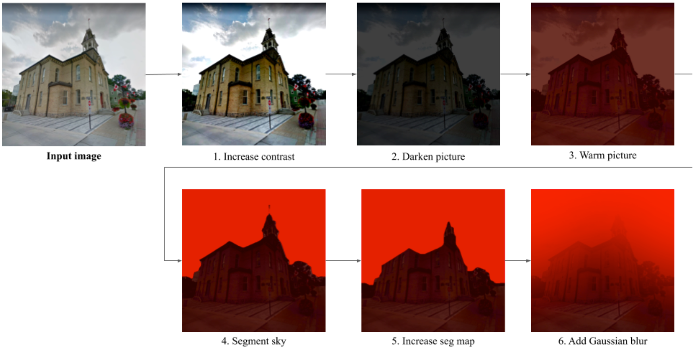
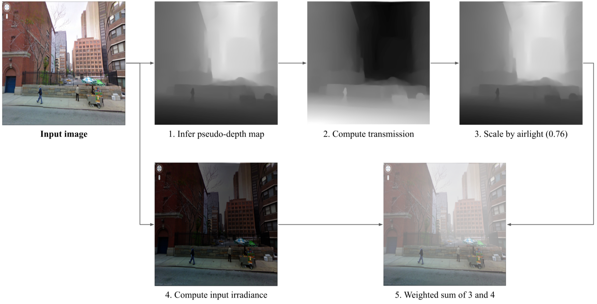

# ClimateGAN: Raising Awareness about Climate Change by Generating Images of Floods

This repository contains the code used to train the model presented in our **[paper](https://arxiv.org/abs/2110.02871)**.

It is not simply a presentation repository but the code we have used over the past 30 months to come to our final architecture. As such, you will find many scripts, classes, blocks and options which we actively use for our own development purposes but are not directly relevant to reproduce results or use pretrained weights.


If you use this code, data or pre-trained weights, please cite our ICLR 2022 paper:

```
@inproceedings{schmidt2022climategan,
  title     = {Climate{GAN}: Raising Climate Change Awareness by Generating Images of Floods},
  author    = {Victor Schmidt and Alexandra Luccioni and M{\'e}lisande Teng and Tianyu Zhang and Alexia Reynaud and Sunand Raghupathi and Gautier Cosne and Adrien Juraver and Vahe Vardanyan and Alex Hern{\'a}ndez-Garc{\'\i}a and Yoshua Bengio},
  booktitle = {International Conference on Learning Representations},
  year      = {2022},
  url       = {https://openreview.net/forum?id=EZNOb_uNpJk}
}
```

## Using pre-trained weights

In the paper, we present ClimateGAN as a solution to produce images of floods. It can actually do **more**: 

* reusing the segmentation map, we are able to isolate the sky, turn it red and in a few more steps create an image resembling the consequences of a wildfire on a neighboring area, similarly to the [California wildfires](https://www.google.com/search?q=california+wildfires+red+sky&source=lnms&tbm=isch&sa=X&ved=2ahUKEwisws-hx7zxAhXxyYUKHQyKBUwQ_AUoAXoECAEQBA&biw=1680&bih=917&dpr=2).
* reusing the depth map, we can simulate the consequences of a smog event on an image, scaling the intensity of the filter by the distance of an object to the camera, as per [HazeRD](http://www2.ece.rochester.edu/~gsharma/papers/Zhang_ICIP2017_HazeRD.pdf)




In this section we'll explain how to produce the `Painted Input` along with the Smog and Wildfire outputs of a pre-trained ClimateGAN model.

### Installation

This repository and associated model have been developed using Python 3.8.2 and **Pytorch 1.7.0**.

```bash
$ git clone git@github.com:cc-ai/climategan.git
$ cd climategan
$ pip install -r requirements-3.8.2.txt # or `requirements-any.txt` for other Python versions (not tested but expected to be fine)
```

Our pipeline uses [comet.ml](https://comet.ml) to log images. You don't *have* to use their services but we recommend you do as images can be uploaded on your workspace instead of being written to disk.

If you want to use Comet, make sure you have the [appropriate configuration in place (API key and workspace at least)](https://www.comet.ml/docs/python-sdk/advanced/#non-interactive-setup)

### Inference

1. Download and unzip the weights [from this link](https://drive.google.com/u/0/uc?id=18OCUIy7JQ2Ow_-cC5xn_hhDn-Bp45N1K&export=download) (checkout [`gdown`](https://github.com/wkentaro/gdown) for a commandline interface) and put them in `config/`

  ```
  $ pip install gdown
  $ mkdir config
  $ cd config
  $ gdown https://drive.google.com/u/0/uc?id=18OCUIy7JQ2Ow_-cC5xn_hhDn-Bp45N1K
  $ unzip release-github-v1.zip
  $ cd .. 
  ```

2. Run from the repo's root:
    
    1. With `comet`:

    ```bash
    python apply_events.py --batch_size 4 --half --images_paths path/to/a/folder --resume_path config/model/masker --upload
    ```

    2. Without `comet` (and shortened args compared to the previous example):

    ```bash
    python apply_events.py -b 4 --half -i path/to/a/folder -r config/model/masker --output_path path/to/a/folder
    ```

The `apply_events.py` script has many options, for instance to use a different output size than the default systematic `640 x 640` pixels, look at the code or `python apply_events.py --help`.

## Training from scratch

ClimateGAN is split in two main components: the Masker producing a binary mask of where water should go and the Painter generating water within this mask given an initial image's context.

### Configuration

The code is structured to use `shared/trainer/defaults.yaml` as default configuration. There are 2 ways of overriding those for your purposes (without altering that file):

1. By providing an alternative configuration as command line argument `config=path/to/config.yaml`

    1. The code will first load `shared/trainer/defaults.yaml`
    2. *then* update the resulting dictionary with values read in the provided `config` argument.
    3. The folder `config/` is NOT tracked by git so you would typically put them there

2. By overwriting specific arguments from the command-line like `python train.py data.loaders.batch_size=8`


### Data

#### Masker

##### Real Images

Because of copyrights issues we are not able to share the real images scrapped from the internet. You would have to do that yourself. In the `yaml` config file, the code expects a key pointing to a `json` file like `data.files.<train or val>.r: <path/to/a/json/file>`. This `json` file should be a list of dictionaries with tasks as keys and files as values. Example:

```json
[
    {
    "x": "path/to/a/real/image",
    "s": "path/to/a/segmentation_map",
    "d": "path/to/a/depth_map"
    },
...
]
```

Following the [ADVENT](https://github.com/valeoai/ADVENT) procedure, only `x` should be required. We use `s` and `d` inferred from pre-trained models (DeepLab v3+ and MiDAS) to use those pseudo-labels in the first epochs of training (see `pseudo:` in the config file)

##### Simulated Images

We share snapshots of the Virtual World we created in the [Mila-Simulated-Flood dataset](). You can download and unzip one water-level and then produce json files similar to that of the real data, with an additional key `"m": "path/to/a/ground_truth_sim_mask"`. Lastly, edit the config file: `data.files.<train or val>.s: <path/to/a/json/file>`

#### Painter

The painter expects input images and binary masks to train using the [GauGAN](https://github.com/NVlabs/SPADE) training procedure. Unfortunately we cannot share openly the collected data, but similarly as for the Masker's real data you would point to the data using a `json` file as:

```json
[
    {
    "x": "path/to/a/real/image",
    "m": "path/to/a/water_mask",
    },
...
]
```

And put those files as values to `data.files.<train or val>.rf: <path/to/a/json/file>` in the configuration.

## Coding conventions

* Tasks
  * `x` is an input image, in [-1, 1]
  * `s` is a segmentation target with `long` classes
  * `d` is a depth map target in R, may be actually `log(depth)` or `1/depth`
  * `m` is a binary mask with 1s where water is/should be
* Domains
  * `r` is the *real* domain for the masker. Input images are real pictures of urban/suburban/rural areas
  * `s` is the *simulated* domain for the masker. Input images are taken from our Unity world
  * `rf` is the *real flooded* domain for the painter. Training images are pairs `(x, m)` of flooded scenes for which the water should be reconstructed, in the validation data input images are not flooded and we provide a manually labeled mask `m`
  * `kitti` is a special `s` domain to pre-train the masker on [Virtual Kitti 2](https://europe.naverlabs.com/research/computer-vision/proxy-virtual-worlds-vkitti-2/)
    * it alters the `trainer.loaders` dict to select relevant data sources from `trainer.all_loaders` in `trainer.switch_data()`. The rest of the code is identical.
* Flow
  * This describes the call stack for the trainers standard training procedure
  * `train()`
    * `run_epoch()`
      * `update_G()`
        * `zero_grad(G)`
        * `get_G_loss()`
          * `get_masker_loss()`
            * `masker_m_loss()`  -> masking loss
            * `masker_s_loss()`  -> segmentation loss
            * `masker_d_loss()`  -> depth estimation loss
          * `get_painter_loss()` -> painter's loss
        * `g_loss.backward()`
        * `g_opt_step()`
      * `update_D()`
        * `zero_grad(D)`
        * `get_D_loss()`
          * painter's disc losses
          * `masker_m_loss()` -> masking AdvEnt disc loss
          * `masker_s_loss()` -> segmentation AdvEnt disc loss
        * `d_loss.backward()`
        * `d_opt_step()`
      * `update_learning_rates()` -> update learning rates according to schedules defined in `opts.gen.opt` and `opts.dis.opt`
    * `run_validation()`
      * compute val losses
      * `eval_images()` -> compute metrics
      * `log_comet_images()` -> compute and upload inferences
    * `save()`
